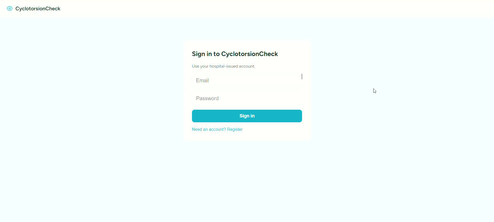
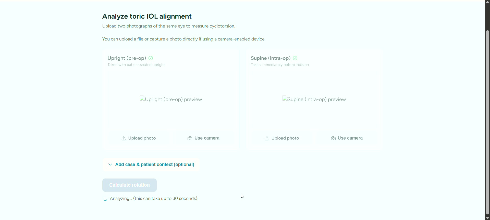
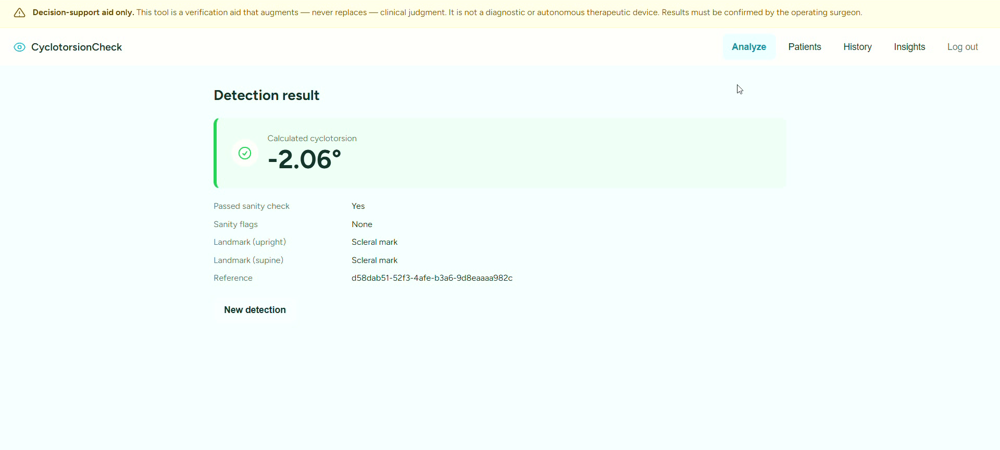

<div align="center">

# CyclotorsionCheck

**AI-powered, camera-based toric IOL alignment verification for cataract surgery** — a free-tier alternative to $100,000+ digital marker hardware (Alcon VERION, Zeiss CALLISTO), built for India's public hospital system.

[](https://github.com/nithiya-rajesh/cyclotorsion-check/actions/workflows/ci.yml)
[](LICENSE)
[](https://patchamomma-2026-bigquery-lab.web.app)

[Live Demo](https://patchamomma-2026-bigquery-lab.web.app) · [API Health](https://cyclotorsion-check-api-949330221093.us-central1.run.app/health) · [PRD](docs/PRD_CyclotorsionCheck.md) · [Technical Design](docs/TDD_CyclotorsionCheck.md)

</div>

> **Decision-support aid only.** This tool augments — never replaces — clinical judgment. It is not a diagnostic or autonomous therapeutic device. Results must be confirmed by the operating surgeon.

---

## The problem

Patients undergoing cataract surgery with astigmatism need a toric IOL rotated to a precise target axis. Between the pre-op measurement (patient seated upright) and the operating table (patient supine), the eye undergoes natural **cyclotorsion** — a 2°–15° rotation from the change in gravitational reference. Every 1° of resulting misalignment degrades astigmatic correction by ~3.3%; a 10° error can cause 30%+ loss of correction, often requiring a second surgery.

Most surgeons — especially across India's high-volume public hospital system (6–8M cataract surgeries/year under NPCB&VI) — compensate with a manual ink mark on the sclera, which smudges under surgical light and lacks precision. Commercial digital alternatives exist but are priced far beyond public-hospital budgets.

## How it works

1. A surgeon uploads two eye photographs: **upright** (pre-op) and **supine** (intra-op).
2. **Gemini** locates a stable anatomical landmark in each photo.
3. A **deterministic trigonometry engine** (not an AI-estimated angle) computes the rotation between them — so every result is mathematically reproducible and auditable.
4. Implausible results (>20° or ~0°) are automatically flagged rather than silently trusted.

All angle calculation and safety validation happen server-side; the frontend contains zero clinical business logic.

## Screenshots

| Sign in | Analyze | Result |
|---|---|---|
|  |  |  |

## Tech stack

| Layer | Technology |
|---|---|
| AI | Google Gemini (`gemini-2.5-flash`) via Vertex AI / Google AI Studio |
| Backend | FastAPI (Python 3.13+), Uvicorn, deployed on Cloud Run |
| Auth | Firebase Authentication + custom-claim RBAC (surgeon / facility_admin / program_officer) |
| Data | BigQuery (aggregate results/analytics), Cloud SQL/PostgreSQL (patient records) |
| Frontend | Framework-free vanilla JS SPA, Firebase Hosting |
| Infra | Terraform + gcloud, Docker (multi-stage), GitHub Actions CI |

## Repository layout

```
backend/    FastAPI service — detection pipeline, auth, patients, storage
frontend/   Framework-free SPA (login, analyze, patients, history, insights)
docs/       PRD, Technical Design Document, screenshots
infra/      Terraform + gcloud deploy scripts
scripts/    Synthetic data generation, accuracy evaluation, smoke tests
docker/     Multi-stage Dockerfile (api + backup targets)
```

## Running locally

**Backend** (mock detector + in-memory storage + open auth by default — no cloud credentials needed):
```bash
cd backend
pip install -e ".[dev]"
python -m cyclotorsion
```

**Frontend** (no build step):
```bash
cd frontend
npm run serve   # http://localhost:8090
```

Open `frontend/js/config.js` and set `FIREBASE_CONFIG` to your own Firebase project to enable sign-in — see [`frontend/README.md`](frontend/README.md).

### Tests

```bash
cd backend && python -m pytest
cd frontend && npm test && npm run lint
```

## Deploying

See [`infra/README.md`](infra/README.md) and [`infra/gcloud/deploy.sh`](infra/gcloud/deploy.sh) for the full Cloud Run + BigQuery + Secret Manager deployment, and `firebase deploy --only hosting` for the frontend.

## Documentation

- [Product Requirements Document](docs/PRD_CyclotorsionCheck.md) — vision, epics/user stories, clinical validation pathway, risk register, phased roadmap
- [Technical Design Document](docs/TDD_CyclotorsionCheck.md) — architecture, data model, security, observability, alternatives considered

## Status

Working prototype, deployed and verified end-to-end (auth → detect → BigQuery, real Gemini via Vertex AI). Synthetic-data-validated (~0.14° MAE benchmark) — real clinical validation (IEC ethics approval, real patient images, ground-truth accuracy study) has not started. Current deployment region is `us-central1` (accepted for the demo/trial phase only); migration to an India-based region (`asia-south1`/`asia-south2`) is a hard gate before any real patient data.

## License

[PolyForm Noncommercial License 1.0.0](LICENSE) — matches this project's intent as a non-commercial, portfolio-driven public health initiative, not a commercial venture. See [`docs/PRD_CyclotorsionCheck.md`](docs/PRD_CyclotorsionCheck.md) §3 for the adoption/sustainability model.
