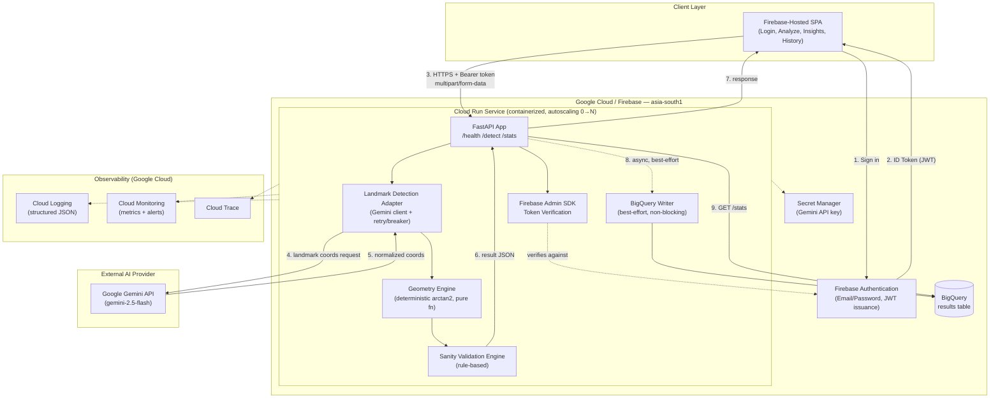

# CyclotorsionCheck — Technical Design Document

**Author's note on scope calibration:** This TDD applies enterprise engineering
rigor — correctness, security, observability, documented trade-offs — scaled
appropriately to the PRD's actual operating envelope: a sponsor-funded,
non-profit pilot serving 1–3 government hospitals in V1, with a phased path to
multi-facility scale gated by clinical validation outcomes (PRD Section 8).
Where a canonical "big tech" pattern (Kafka, Kubernetes, multi-region
active-active) is deliberately *not* chosen, the trade-off is justified in
Section 7 — over-engineering for hyperscale traffic that doesn't exist would
itself be a design failure for a cost-constrained, single-maintainer project.

---

## Table of Contents

1. [Executive Summary & Goals](#1-executive-summary--goals)
2. [System Architecture](#2-system-architecture)
3. [Data Architecture & Storage Strategy](#3-data-architecture--storage-strategy)
4. [Scalability & Resilience](#4-scalability--resilience-the-ilities)
5. [Security & Compliance](#5-security--compliance)
6. [Observability](#6-observability)
7. [Alternative Solutions Considered](#7-alternative-solutions-considered)
8. [Appendix A: Program Requirements Traceability](#appendix-a-program-requirements-traceability)
9. [Appendix B: Infrastructure Commands](#appendix-b-infrastructure-commands-not-executable-from-this-environment)

---

## 1. Executive Summary & Goals

### 1.1 Overview

CyclotorsionCheck's technical system exists to do one thing reliably: given two
eye photographs, return a trustworthy, safety-checked rotation angle within a
clinically usable timeframe, without ever persisting a patient-identifiable
image. Everything in this document is subordinate to that single, narrow
correctness guarantee — the architecture is intentionally simple where
simplicity doesn't compromise it, and rigorous where the PRD's compliance
commitments (DPDP Act, India data residency, and — as of PRD Epic 7 — consented,
facility-scoped, erasable patient records rather than a blanket zero-PII
guarantee, see Section 3.2a) leave no room for shortcuts.

### 1.2 High-Level Objectives

| Objective | Target |
|---|---|
| Detection latency | p95 ≤ 10s per request under normal operating conditions (PRD US-2.3) |
| Correctness | Deterministic geometry engine, not model-estimated angles (PRD Epic 2 design rationale) |
| Availability | Best-effort high availability via serverless auto-scaling; **not** a formal SLA-backed system (see 1.3) |
| Data residency | 100% of persisted data in an India-based Google Cloud region |
| PII footprint | Zero eye-image persistence, unchanged (Section 3.1). **Updated by PRD Epic 7:** patient identity (name, DOB, MRN) is now deliberately persisted in a dedicated, access-controlled store (Section 3.2a) — the "zero PII" target applied system-wide is superseded by "100% consented, facility-scoped, erasable" (PRD Section 1.6) |
| Security posture | Authenticated API access, encrypted transit/rest, least-privilege service accounts |

### 1.3 Explicit Non-Goals

- **No formal 99.9%+ uptime SLA.** This is a pilot-stage tool operated by a
  small, non-profit team with no dedicated SRE on-call rotation (PRD Section
  3.3, R7). Committing to an SLA the operating team cannot realistically staff
  would be dishonest engineering, not rigor.
- **No multi-region active-active failover in V1.** Single-region
  (`asia-south1`) deployment is an accepted, documented risk trade-off (see
  Section 4.4), not an oversight.
- **No event-streaming architecture (Kafka/Pub/Sub) in V1.** Request volume at
  pilot scale does not justify the operational overhead (see Section 7.1).
- **No Kubernetes/GKE.** Serverless Cloud Run directly serves the PRD's
  cost-sustainability constraint (see Section 7.2).
- **No horizontal database sharding.** Data volume at pilot scale (low
  thousands of rows/year) does not approach a threshold where sharding
  provides any benefit.

---

## 2. System Architecture

### 2.1 High-Level Component Diagram



**Reading the diagram:** steps 1–7 are the synchronous, user-facing critical
path (must complete within the p95 ≤10s target). Step 8 (BigQuery write) is
deliberately **decoupled from the critical path** — a logging failure never
blocks or corrupts the clinical result returned to the surgeon (already
implemented in the prototype's `logging_warning` non-blocking pattern; this TDD
formalizes it as an architectural principle, not an accident of the code).

### 2.2 Subsystem Responsibilities & Boundaries

| Subsystem | Responsibility | Explicit Boundary |
|---|---|---|
| **SPA (Frontend)** | Capture UI, auth flow, result rendering, session-local insights | Contains **zero** business logic for angle calculation or safety validation — a compromised or modified client cannot alter clinical results, since all computation happens server-side |
| **Firebase Authentication** | Identity issuance, credential storage, JWT signing | Does **not** store clinic/facility metadata natively (PRD Section 5.4 documented trade-off — encoded into `displayName`) |
| **FastAPI Service (Cloud Run)** | Request orchestration, token verification, response assembly | Stateless — holds no session or user state between requests; any container instance can serve any request |
| **Landmark Detection Adapter** | Isolates all Gemini API interaction (prompt construction, retry, circuit breaker) behind a single internal interface | The rest of the system never calls Gemini directly — this boundary is what makes Section 7.4 (future AI-provider swap) feasible without touching the geometry or validation engines |
| **Geometry Engine** | Pure, deterministic trigonometric calculation (`arctan2`) | Contains **no** I/O, no network calls, no AI dependency — 100% unit-testable in isolation, and this isolation is the direct engineering consequence of the PRD's own design rationale (Epic 2) that AI should locate landmarks, not estimate angles |
| **Sanity Validation Engine** | Rule-based plausibility check on the calculated angle | Read-only with respect to the calculated angle — flags, never modifies, the result |
| **BigQuery Writer** | Asynchronous, best-effort persistence of aggregate result metadata | Never receives the original image — architecturally incapable of persisting patient-identifiable data, not merely policy-restricted from doing so |

### 2.3 Communication Protocols

| Interaction | Protocol | Justification |
|---|---|---|
| SPA ↔ Firebase Auth | Firebase JS SDK (HTTPS under the hood) | Managed by Firebase; no custom protocol design needed |
| SPA ↔ FastAPI backend | **REST over HTTPS, JSON responses, multipart/form-data for image upload** | Simple request/response semantics match the actual interaction pattern (upload two images, get one result) — no streaming, no bidirectional push requirement exists. gRPC and WebSockets were considered and rejected (Section 7.4) |
| FastAPI ↔ Gemini API | REST over HTTPS (via `google-genai` SDK) | Determined by the external provider's SDK; not a design choice available to us |
| FastAPI ↔ BigQuery | Google Cloud client library (gRPC under the hood, abstracted) | Standard, managed integration; no custom protocol work required |

---

## 3. Data Architecture & Storage Strategy

### 3.1 Core Design Constraint

The single most important data-architecture decision in this system is
negative: **no image, in any form, is ever written to persistent storage.**
Every other data-modeling decision below operates downstream of that
constraint, which is enforced architecturally (temp file deletion in the
request-handling code path, `tempfile.TemporaryDirectory()` context manager
guaranteeing cleanup even on exception) rather than by policy alone.

### 3.2 Schema Design

**`results` table (BigQuery, dataset `cyclotorsion_check`, region `asia-south1`):**

```sql
CREATE TABLE cyclotorsion_check.results (
  test_id             STRING       NOT NULL,   -- random UUID, primary identifier
  timestamp           TIMESTAMP    NOT NULL,
  angle_deg           FLOAT64,
  upright_landmark    STRING,                  -- generic anatomical description, non-identifiable
  rotated_landmark    STRING,
  passed_sanity_check BOOLEAN      NOT NULL,
  sanity_flags        STRING,                  -- comma-joined flag list
  facility_id         STRING,                  -- NULLABLE, reserved for Phase 2 (PRD 8.2)
  user_uid            STRING,                  -- NULLABLE, Firebase UID of the operating clinician (not a patient identifier)
  case_ref             STRING                   -- NULLABLE, facility-generated pseudonymous case code (PRD Epic 6) - NOT patient-identifiable, see cases table below
)
PARTITION BY DATE(timestamp)
CLUSTER BY facility_id;

-- New table (PRD Epic 6): stores case-level context (which eye, planned
-- target axis) keyed by the facility's own pseudonymous case_ref. A
-- results row may reference zero or more cases; a case may have multiple
-- results rows (e.g. a retry). This table, like results, is architecturally
-- incapable of identifying a real patient on its own - case_ref is
-- meaningless without either the facility's own separately-held patient
-- chart, OR (as of PRD Epic 7) the patient_id link below.
CREATE TABLE cyclotorsion_check.cases (
  case_ref          STRING    NOT NULL,   -- facility-generated code, e.g. their own internal case number
  patient_id        STRING,               -- NULLABLE-for-backward-compat, FK to patients.patient_id (PRD Epic 7) -- logical FK only, see 3.2a
  eye_laterality    STRING,               -- 'OD' (right eye) or 'OS' (left eye), NULLABLE
  target_axis_deg   FLOAT64,              -- planned toric IOL axis from the patient's own pre-op biometry, NULLABLE
  iol_model         STRING,               -- NULLABLE, free text
  created_by         STRING,               -- Firebase UID of the surgeon who created this case
  created_at          TIMESTAMP NOT NULL,
  facility_id         STRING                -- NULLABLE, same scoping as results.facility_id
)
CLUSTER BY facility_id;
```

### 3.2a Patient Profile Store (PRD Epic 7)

**A deliberately separate database, not a third BigQuery table — and why.**
`patients` has a fundamentally different access pattern than `results`/
`cases`: it needs low-latency **point lookups and prefix search** (US-7.2 —
"find this patient by name or MRN while a surgeon is standing at the
Analyze screen") and **transactional row-level CRUD** including a
correctness-critical cascading delete (US-7.5). That is precisely the
access pattern Section 3.3 already argues BigQuery is the *wrong* tool for
— BigQuery is an analytical/OLAP engine tuned for append-heavy writes and
aggregate scans, not point reads keyed by a search term typed live at the
point of care. Reusing BigQuery here purely for schema consistency would
repeat the exact mismatch Section 3.3 rejected Cloud SQL/Firestore for, in
the opposite direction.

**Recommended store: Cloud SQL (PostgreSQL), `asia-south1`.** Chosen over
Firestore specifically because DPDP right-to-erasure (US-7.5) needs a real
cascading delete across `patients` → `cases` → `results`, which is far more
naturally expressed as SQL row-level deletes with foreign-key `ON DELETE`
semantics *within* Cloud SQL (for `patients`/`cases`, if `cases` were
co-located) than as manually orchestrated document deletes in Firestore.
Since `cases`/`results` remain in BigQuery (Section 3.3's own justification
for them is unchanged — Epic 4's aggregate analytics still need OLAP-style
`AVG`/`COUNT`), the cross-database link below is a **logical FK, not an
enforced one** — see the cascading-delete note.

```sql
-- Cloud SQL (PostgreSQL), separate instance/database from BigQuery.
-- Chosen for point-lookup + transactional-CRUD access pattern (US-7.1-7.6),
-- not the aggregate/analytical pattern BigQuery serves for results/cases.
CREATE TABLE patients (
  patient_id      UUID PRIMARY KEY DEFAULT gen_random_uuid(),
  full_name       TEXT NOT NULL,
  date_of_birth   DATE NOT NULL,
  mrn             TEXT NOT NULL,            -- hospital-assigned Medical Record Number
  phone           TEXT,                     -- NULLABLE
  facility_id     TEXT NOT NULL,            -- enforces US-7.6 facility scoping at the query layer
  created_by      TEXT NOT NULL,            -- Firebase UID of the registering clinician
  created_at      TIMESTAMPTZ NOT NULL DEFAULT now(),
  consent_captured_by TEXT NOT NULL,        -- Firebase UID (PRD US-7.4)
  consent_captured_at TIMESTAMPTZ NOT NULL, -- PRD US-7.4
  UNIQUE (facility_id, mrn)                 -- one MRN per facility; MRNs are not globally unique across hospitals
);

CREATE INDEX idx_patients_facility_name ON patients (facility_id, full_name);
CREATE INDEX idx_patients_facility_mrn  ON patients (facility_id, mrn);

-- Separate, PII-free audit log for right-to-erasure events (PRD US-7.5).
-- Deliberately contains no identifiable field, only the fact and actor of
-- deletion — this table is intentionally NEVER deleted, so a compliance
-- audit can always answer "was patient X's data erased, by whom, when"
-- without that answer requiring the very data it's attesting was erased.
CREATE TABLE patient_erasure_log (
  erasure_id      UUID PRIMARY KEY DEFAULT gen_random_uuid(),
  patient_id      UUID NOT NULL,            -- retained post-deletion, deliberately not a live FK
  requested_by    TEXT NOT NULL,            -- Firebase UID of the requesting admin
  facility_id     TEXT NOT NULL,
  erased_at       TIMESTAMPTZ NOT NULL DEFAULT now(),
  cases_deleted   INT NOT NULL,             -- count only, no case_ref values retained
  results_deleted INT NOT NULL              -- count only, no test_id values retained
);
```

**Cascading delete implementation (US-7.5), cross-database:** because
`patients` (Cloud SQL) and `cases`/`results` (BigQuery) are separate
systems, there is no database-enforced cascade across them. The erasure
handler must therefore, within a single application-level operation: (1)
query BigQuery for every `case_ref` where `cases.patient_id` matches, (2)
`DELETE` the matching rows from `results` then `cases` in BigQuery, (3)
`DELETE` the row from `patients` in Cloud SQL, (4) write one row to
`patient_erasure_log` with the counts from step 2. If step 2 or 3 fails
partway, the handler must retry to completion rather than leave orphaned
rows — this is the one place in the system where "best-effort, eventually
consistent" (Section 3.4's stance for the BigQuery analytics write) is
**not** acceptable, because an incomplete erasure is a DPDP compliance
failure, not a tolerable analytics gap.

**Design notes:**

- **`cases.patient_id` is a logical foreign key across two different
  database systems, not an enforced one.** No BigQuery constraint mechanism
  can validate it against Cloud SQL's `patients.patient_id` at write time.
  The application layer is responsible for validating the referenced
  patient exists (and belongs to the same `facility_id`) before writing a
  case — this is a real, accepted trade-off of splitting the two stores by
  access pattern (3.2a) rather than a gap that was overlooked.
- **`case_ref` is a pseudonymous, facility-controlled code, never a real
  identity field.** The PRD (Epic 6, US-6.4) requires a lightweight
  pattern-check warning if a surgeon enters something that looks like a real
  name or date of birth into this field - a UX safety nudge, not a
  technical guarantee, consistent with how this project treats
  architectural enforcement as primary and policy/UX as a secondary layer
  (see Epic 5's own framing).
- **`target_axis_deg` directly replaces the frontend's previous hardcoded
  85° placeholder** used in the "corrected axis" calculation - when a case
  reference is attached, the corrected axis becomes clinically real (target
  axis + detected rotation) instead of a demo placeholder.
- **`cases` is a separate table, not just more columns on `results`**,
  because the relationship is genuinely one-to-many (one case, potentially
  multiple detection attempts) - modeling it as a separate table avoids
  duplicating case-level data (target axis, eye laterality) across every
  retry row.
- **`facility_id` is added now, as a nullable column, even though it's unused
  until Phase 2** (PRD Section 8.2, facility-scoped analytics). This is a
  deliberate schema-evolution decision: adding a nullable column later is a
  trivial, zero-downtime BigQuery operation, but *retroactively partitioning/
  clustering* a table that has grown large without this column from day one is
  meaningfully more disruptive. Paying this near-zero cost now avoids a real
  migration cost later.
- **`user_uid` is the Firebase UID of the clinician who ran the test, not any
  patient identifier.** This directly supports Epic 4's audit/analytics needs
  without violating the zero-patient-PII constraint — the distinction between
  "who operated the tool" and "who the patient was" is architecturally
  significant and is called out explicitly here to prevent future
  misinterpretation of this field's purpose.
- **Partitioning by `DATE(timestamp)`** keeps query costs low as the table
  grows (BigQuery only scans relevant date partitions for time-bounded
  queries) and directly supports a future data-lifecycle policy (e.g.,
  auto-expiring partitions older than N years) without additional schema work.

### 3.3 Database Choice: BigQuery vs. Alternatives

| Option | Verdict | Justification |
|---|---|---|
| **BigQuery (chosen)** | ✅ | Access pattern is **append-heavy writes + aggregate analytical reads** (`COUNT`, `AVG`, `SAFE_DIVIDE` pass-rate) for Epic 4's Insights dashboard — this is precisely what a columnar OLAP engine is built for |
| Cloud SQL (PostgreSQL) | ❌ Rejected | Would work, but is the wrong tool: a transactional RDBMS is optimized for row-level point reads/writes and referential integrity, neither of which this workload needs. Adds operational overhead (connection pooling, instance sizing, patching) with no corresponding benefit at this access pattern |
| Firestore (NoSQL) | ❌ Rejected | Firestore excels at low-latency point lookups by document ID, not SQL-style aggregation. Computing "average angle across all tests" would require either expensive full-collection reads client-side or a separate aggregation pipeline (e.g., Cloud Functions incrementing counters on write) — meaningful added complexity with no benefit over BigQuery's native `AVG()` |

**Updated by Epic 7 (Patient Profile):** this verdict applies to
`results`/`cases` specifically. The new `patients` store (Section 3.2a) has
the *opposite* access pattern — point lookup and search by name/MRN,
transactional CRUD, cascading delete — and is deliberately **not** placed in
BigQuery for exactly the reason this table already argues against Cloud SQL
for the analytics workload, applied in reverse: the right tool depends on
the access pattern, and `patients` and `results`/`cases` have different
ones. See Section 3.2a for the full justification and the resulting
cross-database trade-off (no enforced FK, application-orchestrated cascade
delete).

### 3.4 Consistency Model

**Chosen model: eventual consistency for analytics, strong consistency for the
user-facing clinical result.**

- The **clinical result returned to the surgeon** (the angle, the sanity
  flags) is computed **in-memory** during the request and returned directly —
  it is never re-read from BigQuery, so its consistency is trivially strong
  (there is no read-after-write race, because there is no read at all in the
  critical path).
- **BigQuery streaming inserts** become query-visible within seconds, not
  instantly — this is BigQuery's standard eventual-consistency behavior for
  streaming writes. This is **explicitly acceptable** here because the
  Insights dashboard (Epic 4) is a trend/aggregate view, not a
  read-your-own-write transactional interface — a surgeon does not need their
  just-completed test to appear in the "All-time" aggregate within
  milliseconds for the system to be correct or safe.
- **No distributed transaction or two-phase commit is used** between the
  clinical result and the BigQuery log write, by design — Section 2.1's
  decoupling of the write from the critical path means a BigQuery outage
  degrades analytics, never patient-facing correctness.

---

## 4. Scalability & Resilience (The "ilities")

### 4.1 Concurrency & Auto-Scaling

| Parameter | V1 (Pilot) Configuration | Rationale |
|---|---|---|
| Cloud Run min instances | 0 | Scale-to-zero directly serves the cost-sustainability constraint (PRD Section 3.3, Risk R7) — a handful of hospitals generating dozens of requests/day does not justify an always-on instance |
| Cloud Run max instances | Low (e.g., 10) | Bounds worst-case cost exposure from any traffic anomaly; pilot-scale traffic will never approach this ceiling under normal use |
| Per-instance concurrency | Default (80) | Each request is I/O-bound (waiting on the Gemini API call), not CPU-bound — a single instance can comfortably serve many concurrent in-flight requests without contention |
| **Phase 2 revision** | `min-instances: 1` | Once daily active usage across multiple facilities makes cold-start latency (Cloud Run's scale-from-zero delay) a recurring surgeon-facing annoyance, the small always-on cost becomes justified — this is an explicit, evidence-gated upgrade, not a Day-1 default |

### 4.2 Caching Strategy

| Cache Target | Strategy | Justification |
|---|---|---|
| Gemini landmark-detection responses | **Not cached in the live API path** (each upload is a genuinely new image pair) | Caching would only help on literal byte-identical re-uploads, which don't occur in real clinical use — this mirrors the disk-cache pattern already used in the *local evaluation script* (`evaluate_accuracy.py`), which exists specifically to avoid re-spending quota during repeated *development-time* testing, not production use |
| `/stats` (Insights "All-time" panel) | **Recommended addition:** short client-side cache (e.g., 30-second TTL) before re-fetching on tab reopen | Reduces redundant BigQuery query load from a surgeon repeatedly clicking between tabs, at negligible staleness cost given the panel's own non-real-time nature (Section 3.4) |
| Firebase ID tokens | Handled automatically by the Firebase Auth SDK (tokens cached client-side, auto-refreshed before the 1-hour expiry) | No custom implementation needed — standard SDK behavior |

### 4.3 Rate Limiting

**Currently absent from the implemented prototype — flagged here as a required
pre-pilot addition, directly motivated by a real incident, not a theoretical
concern:** during development, a single client's repeated testing exhausted
the shared Gemini free-tier daily quota (20 requests/day) multiple times,
degrading service for all subsequent use that day. At pilot scale with
multiple real clinicians sharing one backend deployment, an equivalent
scenario — one user's rapid retries, or a misbehaving client — could degrade
the tool for an entire hospital during live surgery.

**Recommended design:** per-user (keyed by Firebase UID, extracted from the
already-verified token) token-bucket rate limiter — e.g., 20 requests/minute —
enforced as a FastAPI dependency alongside the existing `verify_firebase_token`
dependency. At V1 scale, an in-memory limiter (e.g., `slowapi`) is sufficient;
a distributed backing store (Redis/Memorystore) is explicitly deferred until
Cloud Run `min-instances` exceeds 1 and in-memory state can no longer be
assumed shared across instances (directly tied to the Section 4.1 Phase 2
trigger).

### 4.4 Fault Tolerance

| Failure Mode | Handling Strategy |
|---|---|
| **Gemini API transient overload (503)** | Already implemented: retry with fixed 3-second backoff, max 3 attempts. **Recommended refinement:** add jitter to the backoff interval to avoid synchronized retry storms if multiple requests fail simultaneously |
| **Gemini API sustained outage** | **Recommended addition:** circuit breaker (open after N consecutive failures within a rolling window) to fail fast with a clear "AI provider temporarily unavailable" message, rather than continuing to retry against a service known to be down — protects both user experience (faster, clearer failure) and the provider relationship (doesn't hammer a degraded upstream) |
| **BigQuery write failure** | Already implemented as non-blocking: the clinical result is still returned to the user; the failure is surfaced only as a `logging_warning` field, never as a request failure. This is the deliberate architectural pattern from Section 2.1, restated here as a resilience mechanism, not merely a data-flow detail |
| **Firebase Auth token verification failure** | Fails closed (401 Unauthorized) — access control is treated as a hard boundary, unlike the soft-fail pattern used for analytics logging |
| **Regional outage (`asia-south1`)** | **Accepted risk for V1**, not mitigated by multi-region failover. Justification: (a) Cloud Run's own within-region redundancy across zones already provides meaningful resilience against single-zone failures, which are far more common than full regional outages; (b) the operational cost of active multi-region deployment (data replication strategy, DNS failover, doubled baseline cost) is disproportionate to a pilot serving 1–3 facilities; (c) the tool's own design — augmenting, never replacing, the surgeon's standard ink-marker fallback (PRD Section 6.3) — means a regional outage degrades convenience, not patient safety, since the pre-existing clinical workflow remains available |
| **Disaster recovery (data loss)** | BigQuery data is not the clinical system of record (per PRD's own non-diagnostic positioning) — **recommended** lightweight mitigation: scheduled nightly export to Cloud Storage (`asia-south1`) as a low-cost backup. Target RPO: 24 hours. Target RTO: best-effort (no formal recovery-time commitment), consistent with Section 1.3's explicit non-commitment to a formal SLA |

---

## 5. Security & Compliance

### 5.1 Authentication

**Firebase Authentication, Email/Password provider** (implemented, replacing
the earlier prototype's insecure client-side-only demo auth — PRD Section
5.4). ID tokens are short-lived signed JWTs (1-hour expiry, auto-refreshed by
the client SDK), verified server-side via the Firebase Admin SDK against
Google's publicly-hosted signing certificates (cached by the SDK, so
verification does not incur a network round-trip on every request).

### 5.2 Authorization

**Current state:** binary — a request is either authenticated or rejected
(401). No role differentiation exists yet.

**Recommended RBAC extension**, directly supporting PRD Section 8.2's
facility-scoped analytics requirement:

| Role | Firebase Custom Claim | Access |
|---|---|---|
| `surgeon` | `role: "surgeon"` | `/detect` only |
| `facility_admin` | `role: "facility_admin"` | `/detect` + `/stats` scoped to their own `facility_id` |
| `program_officer` | `role: "program_officer"` | `/stats` across all facilities (aggregate only, still zero patient-identifiable data — patient-profile endpoints, below, remain out of reach for this role) |

Custom claims are set via the Firebase Admin SDK at account-provisioning time
(consistent with the manual allow-listing workaround already documented as the
pilot-phase interim process in PRD Section 5.4) and read inside a FastAPI
dependency that extends the existing `verify_firebase_token` function.

**Added by PRD Epic 7 — patient-profile authorization (US-7.6):** every
`role` above additionally carries a `facility_id` custom claim (already
noted as reserved for Phase 2 in Section 3.2's `facility_id` design note —
Epic 7 is the first consumer that makes it load-bearing rather than
unused). Patient-profile endpoints (`/patients/*`) enforce, on top of the
role check above: the caller's `facility_id` claim must equal the target
patient's stored `facility_id`, checked server-side on every read and
write, never trusted from client-supplied input. A `program_officer`
querying `/stats` still sees only aggregates, by construction (Section
3.2a's separate-database split means there is no query path from `/stats`
into `patients` at all — not merely a filtered one).

### 5.3 Data Encryption

| Layer | Mechanism |
|---|---|
| In transit | TLS 1.2+, enforced by default on both Cloud Run and Firebase Hosting — no custom configuration required |
| At rest — `results`/`cases` (BigQuery) | Google-managed encryption (AES-256) — CMEK remains not required here, unchanged: this data is still non-identifiable on its own (Section 3.1) |
| At rest — `patients` (Cloud SQL) | **Updated by Epic 7 — reverses the prior stance.** Google-managed encryption is the floor, but **customer-managed encryption keys (CMEK) are now recommended**, since this store holds real patient identity (name, DOB, MRN) by design. CMEK's finer-grained key-rotation and IAM-scoped key-access audit trail is exactly the additional control that now has real sensitive data to protect — the prior "not required" conclusion was explicitly conditioned on zero-PII, and that condition no longer holds for this specific store |

### 5.4 Secrets Management

**Current implementation gap, flagged for remediation:** the Gemini API key is
currently passed via Cloud Run's `--set-env-vars` flag, which stores it in
plaintext, visible to anyone with `gcloud run services describe` access on the
project.

**Recommended fix:** migrate to **Google Secret Manager**, with the secret
mounted into the Cloud Run container at runtime rather than passed as a
plaintext environment variable. This is a low-effort, high-value security
upgrade — Secret Manager access is itself governed by IAM, providing an audit
trail of who accessed the key and when, which plaintext env vars cannot offer.

### 5.5 API-Level Security

| Concern | Current State | Recommendation |
|---|---|---|
| CORS policy | `allow_origins=["*"]` (fully open) | **Must be tightened** to the exact Firebase Hosting origin before pilot go-live — the wildcard was an appropriate simplification during prototyping, not an acceptable pilot-phase configuration |
| Input validation | Basic (file upload accepted via FastAPI's `UploadFile`) | **Recommended addition:** explicit file-size limit (e.g., 10MB) and MIME-type allow-list validation before the file is passed to the Gemini API, to reject malformed or oversized uploads early and cheaply |
| Rate limiting | Absent | See Section 4.3 |

### 5.6 Regulatory Compliance Mapping

Direct architectural traceability to the PRD's compliance commitments (PRD
Sections 1.5, 5):

| DPDP Act Principle | Architectural Enforcement |
|---|---|
| Data minimization | Zero image persistence (Section 3.1, unchanged by Epic 7); `patients` (Section 3.2a) stores only the fields Epic 7's user stories actually require (name, DOB, MRN, optional phone) — no fields collected speculatively |
| Purpose limitation | `results`/`cases` still carry no secondary-use risk (Section 3.1). **Updated by Epic 7:** `patients` data is scoped to the single stated purpose (linking this facility's own toric IOL alignment tests to its own patient record) — the consent captured at US-7.4 names that purpose explicitly, and no other read path (e.g. `/stats`) can reach `patients` at all (Section 3.2a) |
| Consent (Epic 7 — new principle, not applicable pre-Epic-7) | Explicit, logged consent capture at profile creation (`patients.consent_captured_by`/`consent_captured_at`, PRD US-7.4) — a lawful-processing basis now genuinely required, where previously none was needed because no personal data existed |
| Data residency | `asia-south1` region for BigQuery, Cloud Run, **and the new Cloud SQL `patients` instance** (Section 3.2a) (**pending migration from current `us-central1` demo deployment — see PRD Section 5.2, an open, accepted gap for the demo phase only**) |
| Right to erasure | `results`/`cases`: row-level deletion via `test_id`, unchanged. **Updated by Epic 7:** a patient-level erasure now cascades through `patients` → `cases` → `results` as a single application-orchestrated operation (Section 3.2a), not just an isolated row — this is the materially harder version of "right to erasure" that only exists once a real patient record exists to erase |

---

## 6. Observability

### 6.1 Metrics

**Built-in (via Cloud Monitoring, zero custom instrumentation required):**
request count, request latency percentiles (p50/p95/p99), container instance
count, error rate — automatically collected for any Cloud Run service.

**Recommended custom metrics** (via Cloud Monitoring's custom metric API or
OpenTelemetry):

| Metric | Purpose |
|---|---|
| `gemini_api_latency_seconds` | Isolates AI-provider latency from total request latency — critical for diagnosing whether a slow response is our system or the upstream provider |
| `gemini_retry_count` | Directly surfaces the frequency of transient 503s — an early warning signal for the kind of quota/overload incidents already encountered during development (Section 4.3) |
| `sanity_check_flag_rate` | A **clinical-quality** metric, not just a technical one — a rising flag rate could indicate image-quality issues at a specific facility worth investigating, not merely a system health signal |
| `bigquery_write_failure_rate` | Monitors the health of the non-blocking analytics path (Section 4.4), which fails silently by design and therefore needs explicit monitoring to avoid an invisible, accumulating data gap |

### 6.2 Centralized Logging

**Recommended structure:** replace any remaining `print()`-based debug output
(a carryover from the prototype's local-development phase) with Python's
`logging` module, emitting **structured JSON** logs that Cloud Logging can
natively parse and index.

**Correlation ID propagation:** generate a `request_id` (UUID) at the start of
each `/detect` request and thread it through every log line for that
request's lifecycle — landmark detection call, geometry calculation, sanity
check, BigQuery write attempt. This makes it possible to reconstruct the full
lifecycle of a single clinical test from logs alone, which matters
disproportionately for a tool whose outputs inform a surgical decision — if a
surgeon later questions a specific result, the full decision trail should be
reconstructable.

### 6.3 Distributed Tracing

**Recommended: Cloud Trace**, with the FastAPI service auto-instrumented and
custom spans added around the Gemini API call and the BigQuery write.

**Honest scoping note:** with a single backend service (no microservices
architecture in V1), "distributed" tracing is, at present, closer to
*detailed request tracing within one service*. It is recommended now anyway
for two reasons: (1) the setup cost on Cloud Run is genuinely low —
essentially free given native GCP integration — and (2) it establishes the
pattern and tooling now, so that if Phase 3's exploratory ABDM integration
(PRD Section 8.3) introduces a second service, trace context propagation
across service boundaries is a configuration change, not a new capability to
build from scratch under time pressure.

### 6.4 Alerting

| Alert Condition | Rationale |
|---|---|
| Error rate > 5% over 5 minutes | Standard availability signal |
| p95 latency > 15 seconds | Breach of the Section 1.2 target, surfaced before it becomes a widespread surgeon complaint |
| Gemini daily quota utilization > 80% | **Directly informed by the real quota-exhaustion incidents encountered during development** — this alert would have provided advance warning before the free-tier cap was hit, rather than discovering it via a failed clinical request |
| `bigquery_write_failure_rate` sustained > 0 for 30+ minutes | Catches a silently-failing analytics path before it accumulates a large, unrecoverable data gap |

---

## 7. Alternative Solutions Considered

### 7.1 Event-Driven Architecture (Kafka / Pub/Sub) — Rejected for V1

**Considered:** decoupling detection requests via a message queue, with
asynchronous workers processing detection jobs and pushing results back to
clients.

**Rejected because:** the actual user interaction is fundamentally
synchronous — a surgeon uploads two photos *during* a live procedure and needs
an answer within seconds to inform an immediate action, not a
fire-and-forget job processed on an indeterminate schedule. Introducing a
queue would add latency (queue hop, worker pickup, result delivery) and
operational complexity (broker provisioning, dead-letter handling, consumer
scaling) with no corresponding benefit at pilot-scale request volume (tens of
requests/day across 1–3 facilities). **Revisit condition:** if Phase 3's
exploratory ABDM reporting integration (PRD Section 8.3) requires fanning
aggregate data out to multiple downstream consumers asynchronously, a
lightweight Pub/Sub topic for *that specific, genuinely async use case* would
be reasonable — but that is a narrow, evidence-gated addition, not a
wholesale architectural shift.

### 7.2 Kubernetes (GKE) vs. Cloud Run — Rejected for V1

**Considered:** running the FastAPI service on GKE for finer-grained
infrastructure control.

**Rejected because:** Cloud Run's scale-to-zero serverless model directly
serves the PRD's own cost-sustainability constraint (Section 3.3, Risk R7) —
a GKE cluster incurs baseline node-pool cost even at zero traffic, which a
sponsor-credit-funded, non-profit pilot cannot justify against near-zero
pilot-scale usage. GKE also introduces meaningfully higher operational burden
(cluster version upgrades, node OS patching, network policy configuration)
that assumes a dedicated platform/SRE function this project does not have.
Cloud Run's managed, fully-serverless model transfers that operational burden
to Google, which is the correct trade-off for a small, non-profit
engineering team's actual capacity. **Revisit condition:** if the project
reaches a scale where sustained, predictable, high-volume traffic makes
Cloud Run's per-request pricing model more expensive than provisioned
capacity — a genuinely unlikely outcome at this project's realistic ceiling,
but worth naming as the theoretical trigger.

### 7.3 Firestore vs. BigQuery for Results Storage — Rejected

Covered in detail in Section 3.3; restated briefly here for completeness of
the trade-off record: Firestore's per-document read/write model does not
naturally support the aggregate analytical queries (`AVG`, `COUNT`,
pass-rate percentage) that Epic 4's Insights dashboard requires, without
building a separate aggregation layer. BigQuery provides this natively.
**Revisit condition:** none currently anticipated — this is not an
evidence-gated deferral like 7.1 and 7.2, but an access-pattern-driven choice
unlikely to change as the system scales, since the analytical nature of the
Insights use case doesn't change with volume.

### 7.4 gRPC / WebSockets vs. REST+JSON — Rejected

**Considered:** gRPC for the frontend-backend interface (lower latency,
binary protocol) or WebSockets (for potential future real-time features).

**Rejected because:** gRPC's primary advantages (binary efficiency, native
streaming) matter most for high-frequency service-to-service calls or
latency-sensitive systems handling many small messages per second — this
system handles occasional, relatively large (image upload) requests, where
protocol overhead is not the dominant latency factor (the Gemini API call
itself dominates total request time, per Section 6.1's recommended latency
metric). gRPC from a browser also requires a grpc-web proxy layer, adding
infrastructure the REST+JSON approach avoids entirely. WebSockets were
considered for a hypothetical future "live camera feed" capture mode, but no
such requirement exists in the current PRD (Epic 1 specifies discrete photo
upload, not live streaming) — introducing WebSocket infrastructure for a
capability not actually requested would be speculative over-engineering.

---

## Appendix A: Program Requirements Traceability

The system described in this TDD was built for a specific hackathon/challenge
brief. This appendix maps each requirement from that brief directly to how
CyclotorsionCheck satisfies it — treated with the same evidentiary rigor as
every other claim in this document, not restated as unverified marketing copy.

### A.1 Idea

**Requirement:** an industry-grade, data-driven idea solving a real problem, no
industry restriction.

**How this is satisfied:** CyclotorsionCheck addresses a specific, quantified
clinical precision gap (PRD Section 1.2) — cyclotorsion-induced toric IOL
misalignment during cataract surgery — using a real accuracy benchmark (0.14°
MAE on synthetic ground truth, Section 3.2 of the PRD's Results) rather than an
unvalidated concept. "Data-driven" is satisfied literally: the core detection
pipeline is a measurement system, and its own accuracy claim is itself derived
from measured data, not asserted.

### A.2 Data

**Requirement:** synthetic data, BigQuery public datasets, or Kaggle datasets
only — no confidential work data.

**How this is satisfied:** All test data used in development is **synthetic**,
generated programmatically (`generate_synthetic_data.py`) with digitally
rotated eye images and exactly known ground-truth angles — not sourced from
any public dataset, Kaggle, or confidential source, and containing no real
patient data of any kind. This is stricter than the brief's minimum bar (which
would have permitted using a public dataset), and was a deliberate choice: no
public dataset of paired pre-op/intra-op eye rotation photographs exists (PRD
Section 1.2), so synthetic generation was the only viable path to a
ground-truth-labeled test set at all.

### A.3 Technology (Google Cloud Stack)

| Brief-Suggested Tool | Used? | How / Why Not |
|---|---|---|
| Google AI Studio (Gemini API key) | ✅ Used, then evolved | Used during prototyping; the production architecture (Section 5.1 of this TDD) migrates to **Vertex AI with Application Default Credentials** specifically to eliminate the API-key secret entirely — a deliberate hardening beyond the brief's baseline suggestion |
| BigQuery | ✅ Used | Core results/analytics store (TDD Section 3) — chosen explicitly over Firestore/Cloud SQL for its aggregate-query fit (TDD Section 3.3) |
| Firebase (Firestore) | ⚠️ Partially | Firebase **Authentication** and **Hosting** are used (TDD Sections 5.1, 7.4); **Firestore itself is not used** — user profile data (name/clinic) is encoded into the Firebase Auth `displayName` field instead (PRD Section 5.4), a deliberate trade-off documented to avoid standing up a second database for two fields at pilot scale |
| Cloud Run | ✅ Used | Hosts the FastAPI detection service (TDD Section 2.1) — chosen over GKE specifically for its serverless cost profile (TDD Section 7.2) |
| ADK (Agent Development Kit) | ❌ Not used | **Correction:** an earlier draft of this appendix claimed an `agents_adk.py` two-agent wrapper (landmark detector + sanity auditor) existed as an optional/bonus component. It does not exist in the codebase and was never built — that claim was aspirational, not a description of shipped code, and is retracted here rather than left standing. **Why it was never built, on its own merits:** the core pipeline is deliberately deterministic by design (TDD Section 2.2) — the AI locates a landmark, and a pure `arctan2` geometry function computes the angle, specifically so the result is mathematically reproducible and auditable rather than agent-estimated. Wrapping that pipeline in an agent framework would add a dependency, a new component to test, and a new failure surface to a clinical-safety-adjacent code path, for a capability (multi-step agentic orchestration) this single, linear pipeline doesn't need. Consistent with this TDD's own stated philosophy (Executive Summary, Section 7) of not adopting a tool the workload doesn't justify. |
| MCP Toolbox for Databases | ❌ Not used | No requirement exists for orchestrating multiple heterogeneous databases or complex agentic tool-calling across data sources — the system's single BigQuery table and simple read/write pattern (TDD Section 3) do not warrant this framework's complexity |
| AlloyDB Omni / Gemma (on-prem) | ❌ Not used | On-prem hosting directly conflicts with the project's serverless, zero-infrastructure-maintenance design goal (TDD Section 7.2's justification against GKE applies equally here) — a non-profit team without dedicated infrastructure staff is the wrong operator profile for self-hosted database and model infrastructure |
| Pub/Sub | ❌ Not used | Explicitly evaluated and rejected — see TDD Section 7.1's full justification against event-driven architecture for this specific synchronous, low-volume workload |
| Looker / Data Studio | ❌ Not used (V1) | The Insights dashboard (PRD Epic 4) is served directly by the FastAPI `/api/stats` endpoint querying BigQuery — sufficient at pilot scale. A dedicated BI tool remains a reasonable Phase 2+ addition if facility-level reporting sophistication grows (PRD Section 8.2), but is not justified for a single aggregate stats panel today |
| Knowledge Catalog | ❌ Not used | No multi-source data governance/discovery need exists at this project's current data footprint (one table, one schema, one team) |

**Summary judgment:** the project deliberately uses a **narrow, justified
subset** of the available Google Cloud toolkit rather than incorporating every
suggested tool — consistent with this TDD's overall design philosophy
(Executive Summary) of right-sizing architecture to actual need rather than
maximizing tool-checklist coverage.

### A.4 Platform

**Requirement:** use the $300 free trial credit; billing account setup via
UPI/credit card; free AI Studio + at least one paid-eligible Cloud service.

**How this is satisfied, including real friction encountered:** the $300 trial
credit was used to unblock Cloud Run, BigQuery, and Cloud Build API access,
which — consistent with the brief's own FAQ — required a billing account to be
linked before those APIs could be enabled at all. **Worth recording honestly
here:** development encountered a documented series of billing/quota
incidents (Gemini free-tier daily caps, a separate "prepayment credits
depleted" state on the AI-Studio-specific billing system, and a project/key
mismatch between the API key's home project and the Cloud Run project) before
reaching a stable configuration. This TDD's Section 5.1/5.4 recommendation to
migrate to Vertex AI with ADC — billing through the same Cloud project as
Cloud Run and BigQuery, rather than AI Studio's separate account state — is a
direct, evidence-based response to that friction, not a theoretical best
practice.

The two free Cloud Run deployments mentioned in the brief were sufficient for
this project's single backend service; the `render`/`netlify` fallback option
was not needed.

### A.5 Team

**Team size:** 1, within the brief's encouraged 1–2 member range.

**Logistics/tracker communication:** handled by the same individual, per the
brief's requirement that "there is always one person who communicates project
logistics and progress."

### A.6 Tracker

As of this document's authoring, the progress tracker referenced in the brief
had not yet been circulated. **Action item:** monitor email for the tracker
link and begin logging Checkpoint progress there once received, consistent
with the checkpoint cadence already tracked informally throughout this
project's build history (synthetic data validation, Cloud Run deployment,
Firebase Hosting deployment, and the authentication/CORS/secrets hardening
covered in this TDD).

## Appendix B: Infrastructure Commands (Not Executable From This Environment)

The following complete this TDD's Section 6 (Observability) and Section 4.4
(Disaster Recovery) recommendations. These are **infrastructure/config
operations against your live GCP project** — this development environment has
no network access to execute them. Run these yourself once the code changes
in this document are deployed.

### B.1 Alerting Policies (TDD Section 6.4)

```bash
# Error rate > 5% over 5 minutes
gcloud alpha monitoring policies create \
  --display-name="CyclotorsionCheck - High Error Rate" \
  --condition-display-name="Error rate > 5%" \
  --condition-filter='resource.type="cloud_run_revision" AND metric.type="run.googleapis.com/request_count" AND metric.label.response_code_class="5xx"' \
  --condition-threshold-value=0.05 \
  --condition-threshold-duration=300s

# p95 latency > 15 seconds
gcloud alpha monitoring policies create \
  --display-name="CyclotorsionCheck - High Latency" \
  --condition-display-name="p95 latency > 15s" \
  --condition-filter='resource.type="cloud_run_revision" AND metric.type="run.googleapis.com/request_latencies"' \
  --condition-threshold-value=15000 \
  --condition-threshold-duration=300s

# NOTE: a direct "Gemini quota utilization > 80%" alert isn't a native
# Cloud Monitoring metric (Gemini/Vertex AI quota isn't exposed the same
# way Cloud Run's own metrics are). Approximate it instead by alerting on
# the gemini_retry_count custom metric (below) trending upward, which is
# what the actual quota-exhaustion incidents during development looked
# like from the outside.
```

### B.2 Custom Metrics (TDD Section 6.1)

Add to `requirements.txt`: `google-cloud-monitoring>=2.20.0`

```python
# Add to app.py - lightweight, best-effort custom metric emission.
# Wrapped in try/except so a Monitoring API hiccup never breaks a request,
# consistent with the same best-effort pattern used for BigQuery logging.
def emit_custom_metric(metric_name: str, value: float):
    if os.environ.get("EMIT_CUSTOM_METRICS", "false").lower() != "true":
        return
    try:
        from google.cloud import monitoring_v3
        client = monitoring_v3.MetricServiceClient()
        project_id = os.environ.get("GCP_PROJECT_ID")
        series = monitoring_v3.TimeSeries()
        series.metric.type = f"custom.googleapis.com/cyclotorsion_check/{metric_name}"
        series.resource.type = "global"
        point = monitoring_v3.Point({
            "interval": {"end_time": {"seconds": int(time.time())}},
            "value": {"double_value": value},
        })
        series.points = [point]
        client.create_time_series(name=f"projects/{project_id}", time_series=[series])
    except Exception:
        pass  # best-effort - never block the request on a metrics failure

# Call sites to add: after gemini_elapsed is computed in /api/detect ->
#   emit_custom_metric("gemini_api_latency_seconds", gemini_elapsed)
# After sanity_check() ->
#   emit_custom_metric("sanity_check_flag_rate", 1.0 if flags else 0.0)
```

Grant the Cloud Run service account `roles/monitoring.metricWriter` for this
to work.

### B.3 Disaster Recovery Export (TDD Section 4.4)

```bash
# One-time: create a Cloud Storage bucket in the same region
gsutil mb -l asia-south1 gs://YOUR_PROJECT_ID-cyclotorsion-backup

# Scheduled nightly export via Cloud Scheduler + a BigQuery export job.
# Create a small Cloud Function or Cloud Run job that runs:
bq extract --destination_format=NEWLINE_DELIMITED_JSON \
  YOUR_PROJECT_ID:cyclotorsion_check.results \
  gs://YOUR_PROJECT_ID-cyclotorsion-backup/results-$(date +%Y%m%d).json

# Then schedule it:
gcloud scheduler jobs create http cyclotorsion-nightly-backup \
  --schedule="0 2 * * *" \
  --uri="YOUR_CLOUD_FUNCTION_OR_RUN_JOB_URL" \
  --http-method=POST \
  --time-zone="Asia/Kolkata"
```

Target RPO: 24 hours. Target RTO: best-effort, per TDD Section 1.3's
explicit non-commitment to a formal SLA.

### B.4 Region Migration to `asia-south1` (PRD Section 5.2)

**Not executed as part of this update — this is a genuine open decision, not
an oversight.** The PRD explicitly recorded `us-central1` as an accepted
exception for the demo phase, with migration required only before real
patient data is introduced (PRD Section 5.2). If you want this done now
rather than at that gate, it is the same redeploy process already used
throughout this build:

```bash
# BigQuery: create a new dataset in asia-south1, copy the table, update
# GCP_LOCATION env var, then redeploy Cloud Run with --region=asia-south1
bq mk --dataset --location=asia-south1 YOUR_PROJECT_ID:cyclotorsion_check_in
bq cp cyclotorsion_check.results cyclotorsion_check_in.results
gcloud run deploy cyclotorsion-check --source . --region asia-south1 ...
```


---

